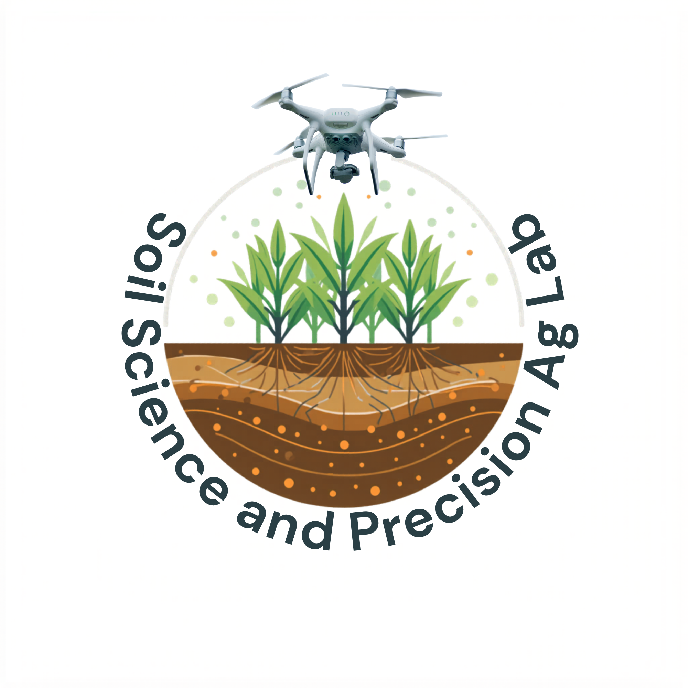

# Soil Science and Precision Agriculture Lab - Website

A modern, responsive multi-page website for the Soil Science and Precision Agriculture Lab at IAAS (Institute of Agriculture and Animal Science), Rampur Campus, Nepal.

**Lab Director:** Prof. Krishna Aryal  
**Location:** Chitwan, Nepal  
**Contact:** krishna.aryal@rc.tu.edu.np | +977-9861598849

---

## 🌐 Project Structure

```
main/
├── index.html              # Home page
├── about.html              # About the lab and Prof. Aryal
├── research.html           # Current research projects
├── publications.html       # Publications and papers
├── opportunities.html      # Join our lab opportunities
├── gallery.html            # Photo gallery
├── team.html               # Team members
├── contact.html            # Contact and location map
├── css/
│   └── styles.css         # Main stylesheet
├── js/
│   └── script.js          # JavaScript functionality
├── images/
│   ├── logo/              # Lab logo
│   ├── gallery/           # Gallery images
│   ├── team/              # Team member photos
│   └── other/             # Additional images
├── README.md              # This file
└── .gitignore             # Git ignore file
```

---

## 🎨 Features

### Multi-Page Architecture
- **Home Page**: Hero section with quick access cards
- **About**: Lab overview, mission, vision, and core values
- **Research**: Detailed research projects and focus areas
- **Publications**: Journal articles and conference presentations
- **Opportunities**: Join the lab - positions available
- **Gallery**: Photo gallery of lab activities
- **Team**: Meet the researchers
- **Contact**: Location map and contact information

### Design Highlights
- **Responsive Design**: Mobile-friendly layout
- **Modern Color Scheme**: 
  - Primary: Deep Blue (#003366)
  - Secondary: Teal (#00695c)
  - Accent: Orange (#ff6600)
- **Interactive Elements**:
  - Smooth navigation
  - Mobile hamburger menu
  - Google Scholar links for publications
  - Interactive map (Leaflet.js)
- **Professional Academic Styling**: Clean, modern academic design

### Technologies Used
- **HTML5**: Semantic markup
- **CSS3**: Flexbox, Grid, CSS variables
- **JavaScript**: Vanilla JS for interactivity
- **External Libraries**:
  - Font Awesome 6.7.0 (Icons)
  - Leaflet.js 1.9.4 (Interactive maps)
  - OpenStreetMap (Map tiles)

---

## 🚀 Quick Start

### Local Testing
```bash
# Navigate to the main folder
cd main

# Start a local server (Python 3)
python3 -m http.server 8000

# Or using Python 2
python -m SimpleHTTPServer 8000

# Visit in browser
http://localhost:8000
```

### With Visual Studio Code
1. Install "Live Server" extension
2. Right-click index.html → "Open with Live Server"

---

## 📤 GitHub Pages Deployment

### Step 1: Create a GitHub Repository
```bash
git init
git add .
git commit -m "Initial commit - Precision Soil Lab website"
git branch -M main
git remote add origin https://github.com/YOUR_USERNAME/REPO_NAME.git
git push -u origin main
```

### Step 2: Enable GitHub Pages
1. Go to your repository settings
2. Scroll to "Pages" section
3. Under "Source", select "Deploy from a branch"
4. Choose "main" branch and "/" (root) folder
5. Click "Save"

### Step 3: Access Your Site
Your website will be available at:
```
https://YOUR_USERNAME.github.io/REPO_NAME/
```

---

## 📝 File Path Conventions

All paths are **relative** for GitHub Pages compatibility:

```html
<!-- Stylesheets -->
<link rel="stylesheet" href="css/styles.css">

<!-- Scripts -->
<script src="js/script.js"></script>

<!-- Images -->

```

---

## 🎯 Key Pages Overview

### Home (index.html)
- Hero section with call-to-action
- 6 quick access cards to main sections

### About (about.html)
- Lab overview and mission
- Research focus areas
- Vision and core values
- Quick statistics

### Research (research.html)
- Current research projects
- Project details and status
- Research methodologies

### Publications (publications.html)
- Journal articles with Google Scholar links
- Conference presentations
- Citation information

### Opportunities (opportunities.html)
- Available positions
- Application requirements
- Contact for inquiries

### Gallery (gallery.html)
- Photo gallery of lab work
- Field research images
- Laboratory activities

### Team (team.html)
- Team member profiles
- Roles and backgrounds
- Contact information

### Contact (contact.html)
- Interactive map showing lab location
- Contact form
- Direct contact details

---

## 🔧 Customization

### Changing Colors
Edit CSS variables in `css/styles.css`:
```css
:root {
    --primary: #003366;      /* Deep blue */
    --secondary: #00695c;    /* Teal */
    --accent: #ff6600;       /* Orange */
    --light-bg: #f5f5f5;     /* Light background */
}
```

### Updating Contact Information
Search for and replace:
- Email: `krishna.aryal@rc.tu.edu.np`
- Phone: `+977-9861598849`
- Location coordinates: `27.607486, 84.565625`

### Adding New Content
1. Create new HTML file in root (same structure as existing pages)
2. Add navigation link in header
3. Update internal links as needed

---

## 📋 Browser Support

- Chrome/Chromium (latest)
- Firefox (latest)
- Safari (latest)
- Edge (latest)
- Mobile browsers

**Requirements:**
- JavaScript enabled
- CSS3 support
- Modern ES6 JavaScript

---

## 🖼️ Required Image Assets

Place images in the `images/` folder:

```
images/
├── logo/
│   └── logo.png
├── gallery/
│   ├── sample.jpeg
│   ├── lab.jpeg
│   ├── Drones.jpeg
│   ├── micro.jpeg
│   └── other images...
└── team/
    ├── krishna.jpeg
    ├── santosh.jpeg
    ├── matrika.jpeg
    └── other team photos...
```

---

## 🔐 Security Notes

- All external resources use HTTPS CDN links
- Relative paths ensure portability
- No sensitive data hardcoded
- Form handling ready for backend integration

---

## 📊 Performance

- **File Size**: Optimized HTML, CSS, JS
- **Load Time**: Fast (minimal HTTP requests)
- **Mobile**: Fully responsive design
- **SEO**: Basic SEO optimization included
- **Accessibility**: Semantic HTML, alt text for images

---

## 🛠️ Maintenance

### Regular Updates
1. Update content in HTML files
2. Replace images in `images/` folder as needed
3. Test locally before pushing to GitHub
4. Commit changes with clear messages

### Best Practices
- Keep file structure organized
- Use descriptive alt text for images
- Maintain consistent formatting
- Update README with major changes
- Test on mobile devices

---

## 📞 Support & Maintenance

For website updates or modifications:
1. Edit relevant HTML/CSS files
2. Test changes locally
3. Commit with descriptive messages
4. Push to GitHub
5. Changes auto-publish to GitHub Pages (within minutes)

---

## 📜 License

© 2026 Soil Science and Precision Agriculture Lab. All rights reserved.

---

## 📅 Version History

- **v2.0** (May 19, 2026): GitHub Pages Ready
  - Multi-page structure finalized
  - CSS/JS/Images organized in proper folders
  - .gitignore added
  - README updated
  - All paths optimized for GitHub Pages

- **v1.0** (May 14, 2026): Initial Release
  - Single-page design
  - Complete content from original site

---

**Last Updated:** May 19, 2026  
**Status:** Ready for GitHub Pages deployment  
**Organization:** Soil Science and Precision Agriculture Lab, IAAS, Rampur Campus, Nepal
